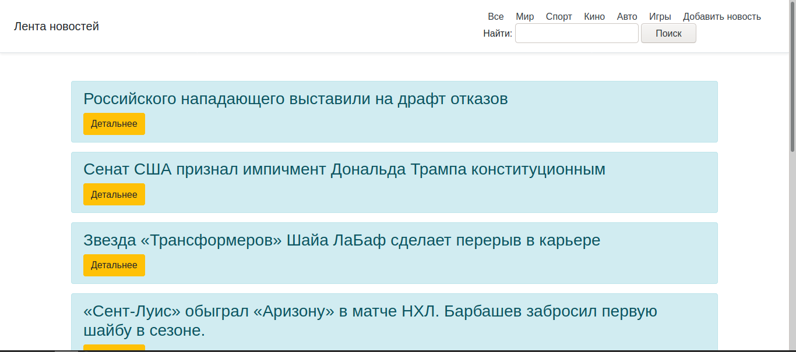
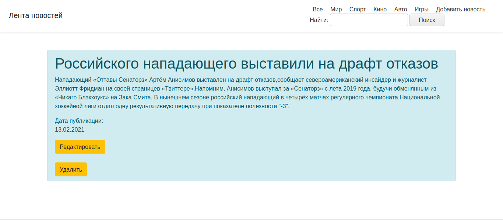
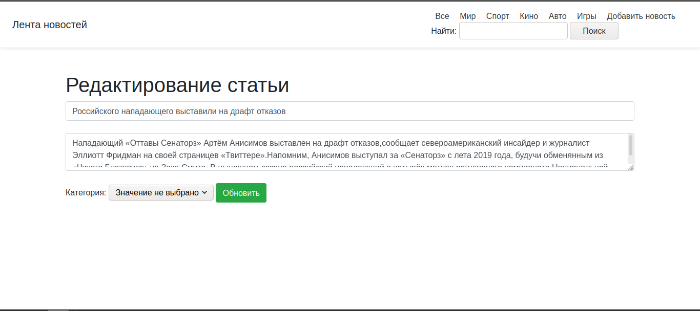
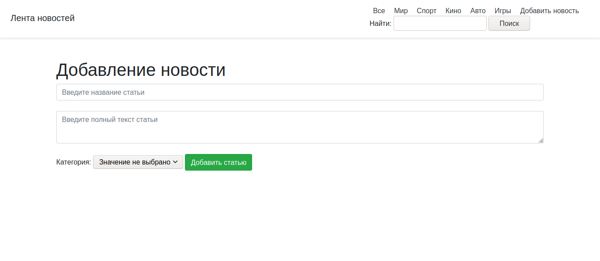

<h1>SpringTestTask / List News</h1>

Приложение предоставляет следующие возможности по работе с новостями:
- просматривать список новостей
- поиск новости по категории (возможность выбрать 
  из существующих категорий), названию и содержанию
- создание и редактирование новости
- удаление новости

<h2>Необходимые инструменты</h2>

JDK от 11 версии 
MySQL от 8 версии

<h2>Запуск проекта</h2>
Перед запуском необходимо создать новую 
базу данных и пользователя:  
- создать базу с именем db_example:

***create database db_example;***

- cоздать пользователя БД под 
  именем springuser и паролем 12345:

***create user 'springuser'@'%' identified by '12345';***

- дать пользователю права на БД db_example:

***grant all on db_example.\* to 'springuser'@'%';***
  

Класс для запуска приложения -
***[DemoApplication.java](./src/main/java/com/testtask/demo/DemoApplication.java)***

В проекте используется миграция Flyway, поэтому
после запуска по умолчанию в базе данных будет 4 новости.

<h2>Главная страница web-приложения</h2>
Главная страница запускается в браузере по
адресу - localhost:8080/

На главной странице отображается 
список всех новостей.

Выбирая категорию Мир, Спорт, Кино, Авто, Игры 
выводится страница со списком новостей 
соответствующей категории, либо пустая страница, 
если в выбранной категории новостей нет.

Нажимая кнопку "Детальнее" на новости, 
открывается страница, отображающая название 
новости, содержание, дату публикации, 
а также кнопки
"Редактировать" и "Удалить".

Кнопка "Удалить" удаляет данную новость и 
переадресовывает на главную страницу.

Кнопка "Редактировать" переадресовывает
на страницу с формой редактирования. Представлены поля,
где можно редактировать заголовок, текст статьи и выбрать 
категорию.
После нажатия кнопки "Обновить" происходит обновление
новости и переход на главную страницу.

При нажатии кнопки "Добавить новость" открывается 
страница с формой для ввода заголовка новости,
текста и выбора категории. Если категория не выбрана,
то по умолчанию будет добавлена категория "Мир". При необходимости 
можно изменить категорию на странице редактирования.
При нажатии кнопки "Добавить статью" новость будет добавлена
и произойдет переход на главную страницу. В случае, если
в заголовке __менее трёх символов или в тексте менее 50 символов__,
то пройдёт переход на главную страницу, но новость 
__не будет добавлена__.

При вводе в строке поиска параметров и нажатии кнопки
"Поиск" происходит переход на страницу, где будет список
новостей, удовлетворяющих условию поиска, 
либо пустая страница, если ничего не найдено.
Поиск осуществляется по заголовку и тексту новостей.

